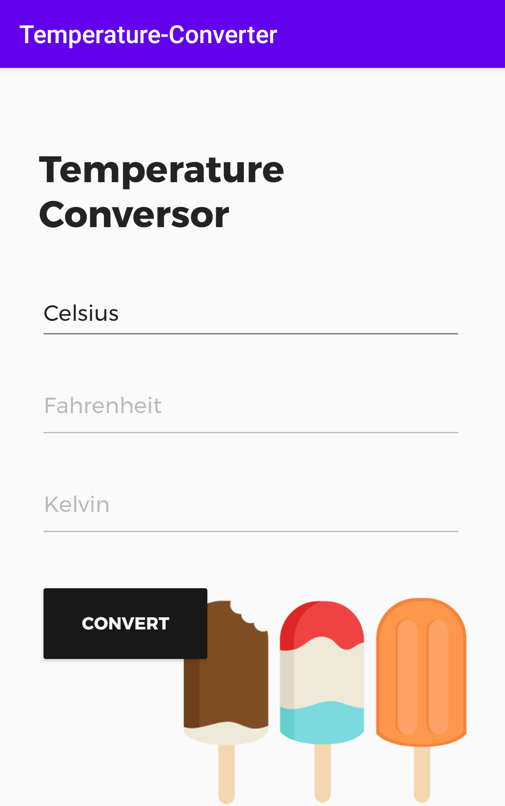
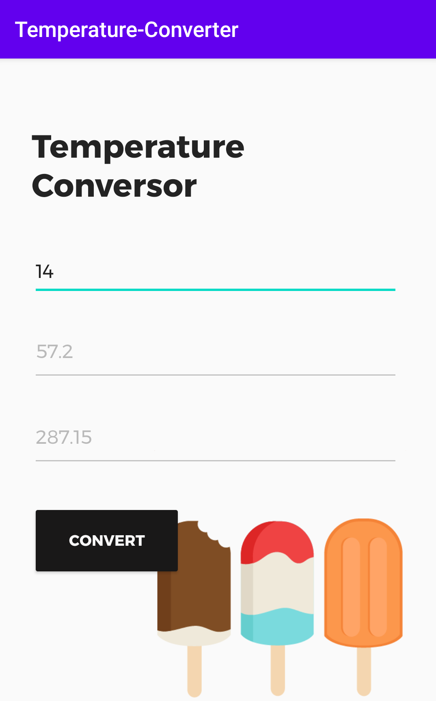

# Temperature-Converter

A temperature converter in Android. Made using Java.

 

   
    
 

## Features

This project presents a simple temperature converter, that can convert Celsius temperature to Kelvin or Fahrenheit. The UI was made using XML android interface building mechanisms. Made in Android Studio.

## Meta

Eduardo Migueis

Distributed under the MIT license. See 'LICENSE' for more information.

Copyright (c) Eduardo Migueis 2020.
